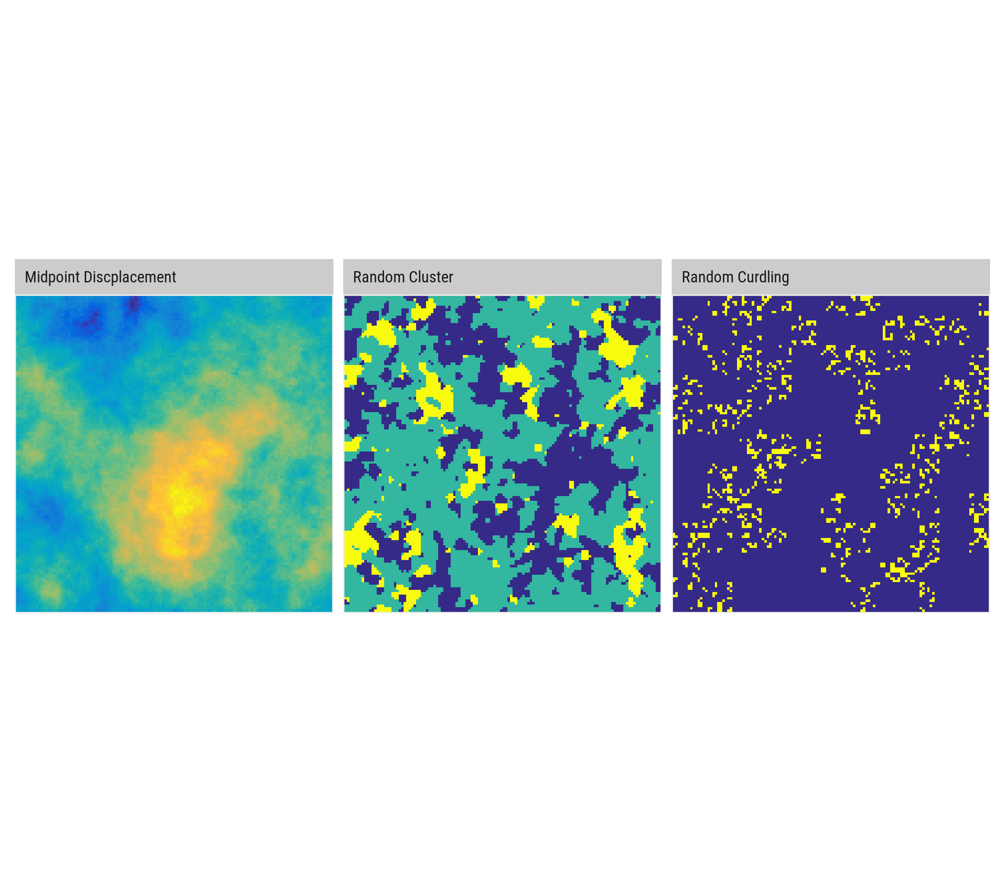
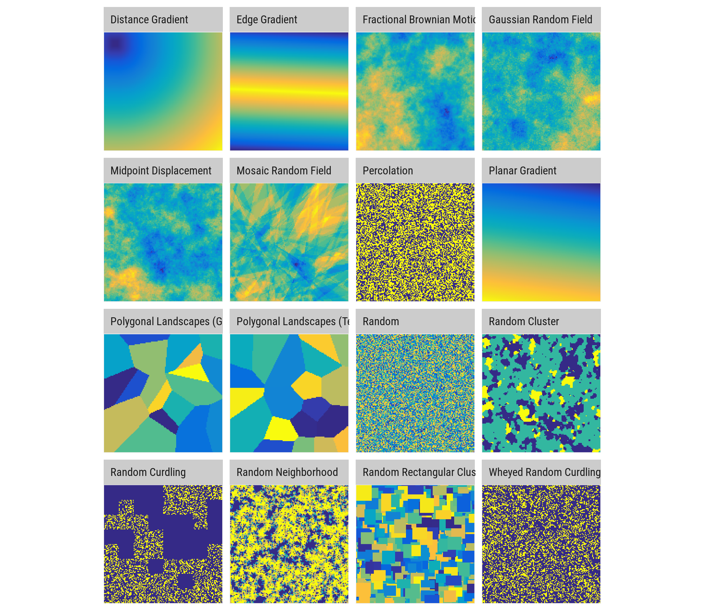

---
output:
  github_document:
    html_preview: false
---


<!-- README.md is generated from README.Rmd. Please edit that file -->

```{r, echo = FALSE}
knitr::opts_chunk$set(
  collapse = TRUE,
  comment = "#>",
  fig.path = "vignettes/README-"
)
```

[](https://travis-ci.org/ropensci/nlmr)
[](https://ci.appveyor.com/project/ropensci/nlmr)
[](https://codecov.io/gh/ropensci/nlmr)
[](https://cran.r-project.org/package=NLMR) 
[](https://gitter.im/nlmr_landscapegenerator) 
[](http://cran.rstudio.com/web/packages/NLMR/index.html) 
[](https://github.com/ropensci/onboarding/issues/188)


`nlmr` is an ``R`` package for simulating **n**eutral **l**andscape **m**odels (NLM). Designed to be a generic framework like [NLMpy](https://pypi.python.org/pypi/nlmpy), it leverages the ability to simulate the most common NLM that are described in the ecological literature. 
`nlmr` builds on the advantages of the ``raster`` package and returns all simulation as ``RasterLayer`` objects, thus ensuring a direct compability to common GIS tasks and a flexible and simple usage.
Furthermore, it simulates NLMs within a self-contained, reproducible framework.

## Installation

Install the release version from CRAN:

```{r eval = FALSE}
install.packages("NLMR")
```

__NOTE__: The version on CRAN is pre-rOpenSci review, so it still contains the
utility functions you find now in [`landscapetools`](https://github.com/ropensci/landscapetools).

To install the developmental version of ``nlmr``, use the following R code:

```{r eval = FALSE}
# install.packages("devtools")
devtools::install_github("ropensci/nlmr", ref = "develop")
```

## Example

Each neutral landscape models is simulated with a single function (all starting with `nlm_`) in `nlmr`, e.g.:

```{r message=FALSE}
random_cluster <- nlmr::nlm_randomcluster(nrow = 100,
                                      ncol = 100,
                                      p    = 0.5,
                                      ai   = c(0.3, 0.6, 0.1),
                                      rescale = FALSE)

random_curdling <- nlmr::nlm_curds(curds = c(0.5, 0.3, 0.6),
                              recursion_steps = c(32, 6, 2))


midpoint_displacememt <- nlmr::nlm_mpd(ncol = 100,
                                 nrow = 100,
                                 roughness = 0.61)
```



## Overview

`nlmr` supplies 14 NLM algorithms, with several options to simulate derivates of
them. The algorithms differ from each other in spatial auto-correlation, from 
no auto-correlation (random NLM) to a constant gradient (planar gradients):  

```{r warning=FALSE, message = FALSE, results='asis', echo=FALSE, cache=FALSE}
library(tibble)
library(magrittr)
library(knitr)
library(kableExtra)

function_tibble <- tibble(Function = character(), Description = character(), Reference = character())

# nlm_curds
function_tibble[1,1] <- "nlm_curds"
function_tibble[1,2] <- "Simulates a curdled neutral landscape model. Random curdling recursively subdivides the plane into blocks. At each level of the recursion, a fraction of the this block is declared as habitat while the remaining stays matrix. When option `q` is set, it simulates a wheyed curdling model, where previously selected cells that were declared matrix during recursion, can now contain a proportion of habitat cells."
function_tibble[1,3] <- "Keitt (2000); Travis and Dytham (2004), Gustafson and Parker (1992)"

# nlm_distancegradient
function_tibble[2,1] <- "nlm_distancegradient"
function_tibble[2,2] <- "Simulates a distance gradient neutral landscape model. The function takes the number of columns and rows as input and creates a *RasterLayer* with the same extent. *Origin* is a numeric vector of xmin, xmax, ymin, ymax for a rectangle inside the raster from which the distance is measured."
function_tibble[2,3] <- "Etherington, Holland, and O’Sullivan (2015)"

# nlm_edgegradient
function_tibble[3,1] <- "nlm_edgegradient"
function_tibble[3,2] <- "Simulates a linear gradient orientated on a specified or random direction that has a central peak, which runs perpendicular to the gradient direction."
function_tibble[3,3] <- "Travis and Dytham (2004)"

# nlm_edgegradient
function_tibble[4,1] <- "nlm_fbm"
function_tibble[4,2] <- "Simulates neutral landscapes are generated using fractional Brownian motion,  an extension of Brownian motion in which the amount of correlation between steps is controlled by the Hurst coefficient *H*."
function_tibble[4,3] <- "Schlather et al. (2015)"

# nlm_gaussianfield
function_tibble[5,1] <- "nlm_gaussianfield"
function_tibble[5,2] <- "Simulates a spatially correlated random fields (Gaussian random fields) model, where one can control the distance and magnitude of spatial autocorrelatian."
function_tibble[5,3] <- "Schlather et al. (2015)"

# nlm_mosaicfield
function_tibble[6,1] <- "nlm_mosaicfield"
function_tibble[6,2] <- "Simulates a mosaic random field neutral landscape model."
function_tibble[6,3] <- "Schlather et al. (2015)"

# nlm_mpd
function_tibble[7,1] <- "nlm_mpd"
function_tibble[7,2] <- "Simulates a midpoint displacement neutral landscape model where the parameter *roughness* controls the level of spatial autocorrelatian."
function_tibble[7,3] <- "Peitgen and Saupe (1988)"

# nlm_neigh
function_tibble[8,1] <- "nlm_neigh"
function_tibble[8,2] <- "Simulates a neutral landscape model with categories and clustering based on neighborhood characteristic."
function_tibble[8,3] <- "Scherer et al. (2016)"

# nlm_percolation
function_tibble[9,1] <- "nlm_percolation"
function_tibble[9,2] <- "Simulates a binary neutral landscape model based on percolation theory. The probality for a cell to be assigned a 1 is drawn from a uniform distribution."
function_tibble[9,3] <- "Gardner et al. (1989)"

# nlm_planargradient
function_tibble[10,1] <- "nlm_planargradient"
function_tibble[10,2] <- "Simulates a planar gradient neutral landscape model with gradient sloping in a specified or random direction."
function_tibble[10,3] <- "Palmer (1992)"

# nlm_polylands
function_tibble[11,1] <- "nlm_polylands"
function_tibble[11,2] <- "Simulates patchy mosaic neutral landscape models built on the basis of spatial point pattern processes such as the Strauss process."
function_tibble[11,3] <- "Gaucherel (2008)"

# nlm_random
function_tibble[12,1] <- "nlm_random"
function_tibble[12,2] <- "Simulates a spatially random neutral landscape model with values drawn a uniform distribution."
function_tibble[12,3] <- ""

# nlm_randomcluster
function_tibble[13,1] <- "nlm_randomcluster"
function_tibble[13,2] <- "Simulates a spatially random neutral landscape model with values drawn a uniform distribution."
function_tibble[13,3] <- "Saura and Martínez-Millán (2000)"

# nlm_randomrectangularcluster
function_tibble[14,1] <- "nlm_randomrectangularcluster"
function_tibble[14,2] <- "Simulates a random rectangular cluster neutral landscape model where rectangular clusters are randomly distributed until the raster is filled."
function_tibble[14,3] <- "Gustafson and Parker (1992)"

kable(function_tibble) %>%
  kable_styling(bootstrap_options = c("striped", "hover", "condensed"))
```



## Meta

* Please [report any issues or bugs](https://github.com/ropensci/nlmr/issues/new/).
* License: GPL3
* Get citation information for `nlmr` in R doing `citation(package = 'nlmr')`
    * Additionally, we keep a [record of publications](https://ropensci.github.io/nlmr/articles/publication_record.html/) that use`nlmr`. Hence, if you used `nlmr` please [file an issue on GitHub](https://github.com/ropensci/nlmr/issues/new/) so we can add it to the list.
* We are very open to contributions - if you are interested check [Contributor Code of Conduct](CONTRIBUTING.md).
    * Please note that this project is released with a [Contributor Code of Conduct](CONDUCT.md). By participating in this project you agree to abide by its terms.

[](http://ropensci.org)

## References
Etherington, Thomas R., E. Penelope Holland, and David O’Sullivan. 2015. “NLMpy: A Python Software Package for the Creation of Neutral Landscape Models Within a General Numerical Framework.” *Methods in Ecology and Evolution* 6 (2): 164–68.

Gardner, R H, R V O’Neill, M G Turner, and V H Dale. 1989. “Quantifying Scale-Dependent Effects of Animal Movement with Simple Percolation Models.” *Landsc. Ecol.* 3 (3/4): 217–27.

Gaucherel, C. 2008. “Neutral Models for Polygonal Landscapes with Linear Networks.” *Ecol. Modell.* 219 (1-2): 39–48.

Gustafson, Eric J, and George R Parker. 1992. “Relationships Between Landcover Proportion and Indices of Landscape Spatial Pattern.” *Landsc. Ecol.* 7: 101–10.

Keitt, Timothy H. 2000. “Spectral Representation of Neutral Landscapes.” *Landsc. Ecol.* 15: 479–93.

Palmer, Michael W. 1992. “The Coexistence of Species in Fractal Landscapes.” *Am. Nat.* 139 (2): 375.

Peitgen, Heinz-Otto, and Dietmar Saupe, eds. 1988. The Science of Fractal Images. New York, NY, USA: *Springer New York*, Inc.

Saura, Santiago, and Javier Martínez-Millán. 2000. “Landscape Patterns Simulation with a Modified Random Clusters Method.” *Landsc. Ecol.* 15 (7): 661–78.

Scherer, Cédric, Florian Jeltsch, Volker Grimm, and Niels Blaum. 2016. “Merging Trait-Based and Individual-Based Modelling: An Animal Functional Type Approach to Explore the Responses of Birds to Climatic and Land Use Changes in Semi-Arid African Savannas.” *Ecol. Modell.* 326: 75–89.

Schlather, Martin, Alexander Malinowski, Peter J Menck, Marco Oesting, Kirstin Strokorb, and Others. 2015. “Analysis, Simulation and Prediction of Multivariate Random Fields with Package RandomFields.” *J. Stat. Softw.* 63: 1–25.

Travis, J M J, and C Dytham. 2004. “A Method for Simulating Patterns of Habitat Availability at Static and Dynamic Range Margins.” *Oikos* 104 410–16.
