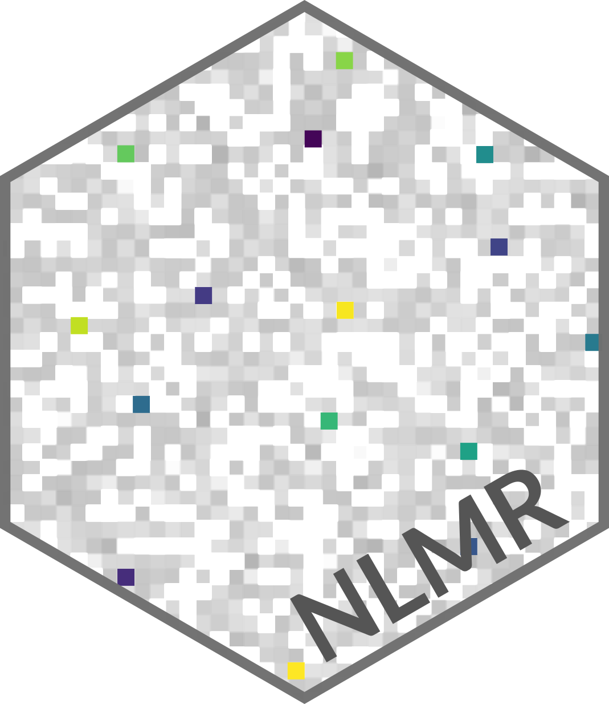

---
output:
  github_document:
    html_preview: false
editor_options: 
  chunk_output_type: console
always_allow_html: yes
---

```{r, echo = FALSE}
knitr::opts_chunk$set(
  collapse = TRUE,
  comment = "#>",
  fig.path = "vignettes/README-"
)
```
[](https://travis-ci.org/ropensci/NLMR)[](https://ci.appveyor.com/project/ropensci/NLMR)
[](https://codecov.io/gh/ropensci/NLMR)
[](https://cran.r-project.org/package=NLMR) 
[](https://www.tidyverse.org/lifecycle/#maturing)
[](http://cran.rstudio.com/web/packages/NLMR/index.html) 
[](https://github.com/ropensci/onboarding/issues/188)
[](https://doi.org/10.1111/2041-210X.13076)

# NLMR 

**NLMR** is an ``R`` package for simulating **n**eutral **l**andscape **m**odels (NLM). Designed to be a generic framework like [NLMpy](https://pypi.python.org/pypi/nlmpy), it leverages the ability to simulate the most common NLM that are described in the ecological literature. 
**NLMR** builds on the advantages of the **raster** package and returns all simulation as ``RasterLayer`` objects, thus ensuring a direct compatibility to common GIS tasks and a flexible and simple usage.
Furthermore, it simulates NLMs within a self-contained, reproducible framework.

## Installation

Install the release version from CRAN:

```{r eval = FALSE}
install.packages("NLMR")
```

To install the developmental version of **NLMR**, use the following R code:

```{r eval = FALSE}
# install.packages("devtools")
devtools::install_github("ropensci/NLMR")
```

## Example

Each neutral landscape models is simulated with a single function (all starting with `nlm_`) in `NLMR`, e.g.:

```{r eval=FALSE}
random_cluster <- NLMR::nlm_randomcluster(nrow = 100,
                                      ncol = 100,
                                      p    = 0.5,
                                      ai   = c(0.3, 0.6, 0.1),
                                      rescale = FALSE)

random_curdling <- NLMR::nlm_curds(curds = c(0.5, 0.3, 0.6),
                              recursion_steps = c(32, 6, 2))


midpoint_displacememt <- NLMR::nlm_mpd(ncol = 100,
                                 nrow = 100,
                                 roughness = 0.61)
```

## Overview

**NLMR** supplies 15 NLM algorithms, with several options to simulate derivatives of
them. The algorithms differ from each other in spatial auto-correlation, from 
no auto-correlation (random NLM) to a constant gradient (planar gradients):  

```{r warning=FALSE, message = FALSE, results='asis', echo=FALSE, cache=FALSE}
library(tibble)
library(magrittr)
library(knitr)
library(kableExtra)

function_tibble <- tibble(Function = character(), Description = character(), 	Crossreference = character(), Reference = character())

# nlm_curds
function_tibble[1,1] <- "nlm_curds"
function_tibble[1,2] <- "Simulates a randomly curdled or wheyed neutral landscape model. Random curdling recursively subdivides the landscape into blocks. At each level of the recursion, a fraction of these blocks is declared as habitat while the remaining stays matrix. When option q is set, it simulates a wheyed curdling model, where previously selected cells that were declared matrix during recursion, can now contain a proportion of habitat cells"
function_tibble[1,3] <- "Figure 1a,p"
function_tibble[1,4] <- "O’Neill, Gardner, and Turner (1992); Keitt (2000)"

# nlm_distancegradient
function_tibble[2,1] <- "nlm_distancegradient"
function_tibble[2,2] <- "Simulates a distance gradient neutral landscape model. The gradient is always measured from a rectangle that one has to specify in the function (parameter origin)"
function_tibble[2,3] <- "Figure 1b"
function_tibble[2,4] <- "Etherington, Holland, and O’Sullivan (2015)"

# nlm_edgegradient
function_tibble[3,1] <- "nlm_edgegradient"
function_tibble[3,2] <- "Simulates a linear gradient orientated neutral model. The gradient has a specified or random direction that has a central peak, which runs perpendicular to the gradient direction"
function_tibble[3,3] <- "Figure 1c"
function_tibble[3,4] <- "Travis and Dytham (2004); Schlather et al. (2015)"

# nlm_edgegradient
function_tibble[4,1] <- "nlm_fbm"
function_tibble[4,2] <- "Simulates neutral landscapes using fractional Brownian motion (fBm). fBm is an extension of Brownian motion in which the amount of spatial autocorrelation between steps is controlled by the Hurst coefficient H"
function_tibble[4,3] <- "Figure 1d"
function_tibble[4,4] <- "Schlather et al. (2015)"

# nlm_gaussianfield
function_tibble[5,1] <- "nlm_gaussianfield"
function_tibble[5,2] <- "Simulates a spatially correlated random fields (Gaussian random fields) model, where one can control the distance and magnitude of spatial autocorrelation	"
function_tibble[5,3] <- "Figure 1e"
function_tibble[5,4] <- "Schlather et al. (2015)"

# nlm_mosaicfield
function_tibble[6,1] <- "nlm_mosaicfield"
function_tibble[6,2] <- "Simulates a mosaic random field neutral landscape model. The algorithm imitates fault lines by repeatedly bisecting the landscape and lowering the values of cells in one half and increasing the values in the other half. If one sets the parameter infinite to TRUE, the algorithm approaches a fractal pattern"
function_tibble[6,3] <- "Figure 1f"
function_tibble[6,4] <- "Schlather et al. (2015)"

# nlm_neigh
function_tibble[7,1] <- "nlm_neigh"
function_tibble[7,2] <- "Simulates a neutral landscape model with land cover classes and clustering based on neighbourhood characteristics. The cluster are based on the surrounding cells. If there is a neighbouring cell of the current value/type, the target cell will more likely turned into a cell of that type/value"
function_tibble[7,3] <- "Figure 1g"
function_tibble[7,4] <- "Scherer et al. (2016)"

# nlm_percolation
function_tibble[8,1] <- "nlm_percolation"
function_tibble[8,2] <- "Simulates a binary neutral landscape model based on percolation theory. The probability for a cell to be assigned habitat is drawn from a uniform distribution"
function_tibble[8,3] <- "Figure 1h"
function_tibble[8,4] <- "Gardner et al. (1989)"

# nlm_planargradient
function_tibble[9,1] <- "nlm_planargradient"
function_tibble[9,2] <- "Simulates a planar gradient neutral landscape model. The gradient is sloping in a specified or (by default) random direction between 0 and 360 degree"
function_tibble[9,3] <- "Figure 1i"
function_tibble[9,4] <- "Palmer (1992)"

# nlm_mosaictess
function_tibble[10,1] <- "nlm_mosaictess"
function_tibble[10,2] <- "Simulates a patchy mosaic neutral landscape model based on the tessellation of a random point process. The algorithm randomly places points (parameter germs) in the landscape, which are used as the centroid points for a voronoi tessellation. A higher number of points therefore leads to a more fragmented landscape"
function_tibble[10,3] <- "Figure 1k"
function_tibble[10,4] <- "Gaucherel (2008), Method 1"

# nlm_mosaicgibbs	
function_tibble[11,1] <- "nlm_mosaicgibbs	"
function_tibble[11,2] <- "Simulates a patchy mosaic neutral landscape model based on the tessellation of an inhibition point process. This inhibition point process starts with a given number of points and uses a minimisation approach to fit a point pattern with a given interaction parameter (0 ‐ hardcore process; 1 ‐ Poisson process) and interaction radius (distance of points/germs being apart)"
function_tibble[11,3] <- "Figure 1l"
function_tibble[11,4] <- "Gaucherel (2008), Method 2"

# nlm_random
function_tibble[12,1] <- "nlm_random"
function_tibble[12,2] <- "Simulates a spatially random neutral landscape model with values drawn a uniform distribution"
function_tibble[12,3] <- "Figure 1m"
function_tibble[12,4] <- "With and Crist (1995)"
# nlm_randomcluster
function_tibble[13,1] <- "nlm_randomcluster"
function_tibble[13,2] <- "Simulates a random cluster nearest‐neighbour neutral landscape. The parameter ai controls for the number and abundance of land cover classes and p controls for proportion of elements randomly selected to form clusters"
function_tibble[13,3] <- "Figure 1n"
function_tibble[13,4] <- "Saura and Martínez-Millán (2000)"

# nlm_mpd
function_tibble[14,1] <- "nlm_mpd"
function_tibble[14,2] <- "Simulates a midpoint displacement neutral landscape model where the parameter roughness controls the level of spatial autocorrelation"
function_tibble[14,3] <- "Figure 1n"
function_tibble[14,4] <- "Peitgen and Saupe (1988)"

# nlm_randomrectangularcluster
function_tibble[15,1] <- "nlm_randomrectangularcluster"
function_tibble[15,2] <- "Simulates a random rectangular cluster neutral landscape model. The algorithm randomly distributes overlapping rectangles until the landscape is filled"
function_tibble[15,3] <- "Figure 1o"
function_tibble[15,4] <- "Gustafson and Parker (1992)"

kable(function_tibble) %>%
  kable_styling(bootstrap_options = c("striped", "hover", "condensed"))
```


## See also

**NLMR** was split during its development process - to have a minimal dependency version
for simulating neutral landscape models and an utility toolbox to facilitate workflows
with raster data.
If you are interested in merging, visualizing or further handling neutral landscape models
have a look at the [landscapetools](https://github.com/ropensci/landscapetools/) package.

## Meta

* Please [report any issues or bugs](https://github.com/ropensci/NLMR/issues/new/).
* License: GPL3
* Get citation information for `NLMR` in R doing `citation(package = 'NLMR')`
    * Additionally, we keep a [record of publications](https://ropensci.github.io/NLMR/articles/publication_record.html/) that use **NLMR**. Hence, if you used **NLMR** please [file an issue on GitHub](https://github.com/ropensci/NLMR/issues/new/) so we can add it to the list.
* We are very open to contributions - if you are interested check out our [Contributor Guidelines](CONTRIBUTING.md).
    * Please note that this project is released with a [Contributor Code of Conduct](CONDUCT.md). By participating in this project you agree to abide by its terms.

[](http://ropensci.org)
