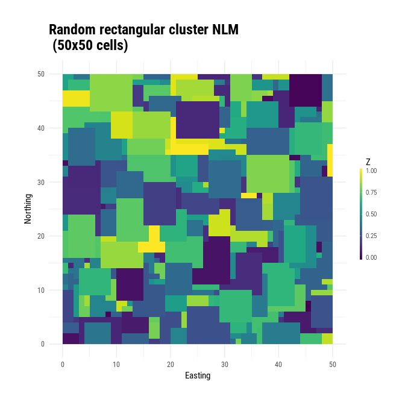
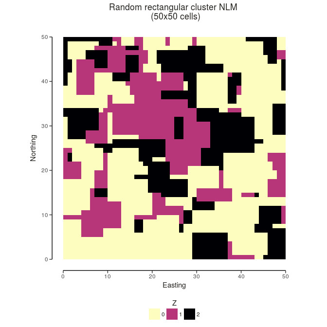

<!-- README.md is generated from README.Rmd. Please edit that file -->
[](https://travis-ci.com/marcosci/NLMR) [](https://codecov.io/gh/marcosci/NLMR) [](https://cran.r-project.org/package=eNLMR) [](https://gitter.im/NLMR_landscapegenerator) [](http://cran.rstudio.com/web/packages/ggplot2/index.html)

NLMR 
=================================================================

`**NLMR**` is an `R` package for simulating **n**eutral **l**andscape **m**odels (NLM). Designed to be a generic framework like [NLMpy](https://pypi.python.org/pypi/nlmpy), it leverages the ability to simulate the most common NLM that are described in the ecological literature. `**NLMR**` he advantages of the `raster`-package and returns all simulation as `RasterLayer`-objects, thus ensuring a direct compability to common GIS tasks and a pretty flexible and simple usage.

Installation
------------

Install the release version from CRAN:

``` r
install.packages("NLMR")
```

To install the developmental version of `NLMR`, use the following R code:

``` r
# install.packages("devtools")
devtools::install_github("marcosci/NLMR")
```

Example
-------

Here we will provide a simple example on using `NLMR`:

``` r
library(NLMR)
library(magrittr)
library(ggplot2)  # to extent the plot functionality of NLMR 
library(SDMTools) # to calculate basic landscape metrics

# Simulate 50x50 rectangular cluster raster
nlm_raster <- nlm_randomrectangularcluster(50,50, resolution = 1, minL = 3, maxL = 7)

# Plot the NLM
util_plot(nlm_raster, scale = "A") +
  labs(title="Random rectangular cluster NLM \n (50x50 cells)")
```



``` r

# Classify into 3 categories
nlm_raster <- nlm_raster %>%
                 util_classify(., c(0.5, 0.25, 0.25))

# Plot the classified NLM
util_plot(nlm_raster, scale = "A", discrete = TRUE) +
  labs(title="Random rectangular cluster NLM \n (50x50 cells)")
```



``` r

# Calculate basic landscape metrics
raster::as.matrix(nlm_raster) %>% 
  PatchStat() %>% 
  knitr::kable()
```

|  patchID|  n.cell|  n.core.cell|  n.edges.perimeter|  n.edges.internal|  area|  core.area|  perimeter|  perim.area.ratio|  shape.index|  frac.dim.index|  core.area.index|
|--------:|-------:|------------:|------------------:|-----------------:|-----:|----------:|----------:|-----------------:|------------:|---------------:|----------------:|
|        0|    1246|          551|                812|              4172|  1246|        551|        812|         0.6516854|     5.718310|        1.490863|        0.4422151|
|        1|     625|          233|                524|              1976|   625|        233|        524|         0.8384000|     5.240000|        1.514565|        0.3728000|
|        2|     629|          168|                610|              1906|   629|        168|        610|         0.9697933|     5.980392|        1.560230|        0.2670906|

Citation
--------

To cite package `**NLMR**` in publications please use:

    Sciaini, M; Simpkins, CE; Fritsch, M; Scherer, C (2017). NLMR: Simulating neutral landscape models with R. R package version 0.1.0. https://github.com/marcosci/NLMR.

Additionally, we keep a [record of publications](https://marcosci.github.io/NLMR/iarticles/publication_record.html) that use`**NLMR**`. Hence, if you used `**NLMR**` please [file an issue on GitHub](https://marcosci.github.io/NLMR/issues/new) so we can add it to the list.

Dependencies
------------

`**NLMR**` imports many great packages that it depends on. Many thanks to the developers of these tools:

     [1] "R (>= 3.1.0)"  " ggplot2"      " rasterVis"    " R.utils"     
     [5] " raster"       " sp"           " stats"        " viridis"     
     [9] " checkmate"    " dplyr"        " gstat"        " dismo"       
    [13] " lemon"        " RandomFields" " spatstat"     " purrr"
