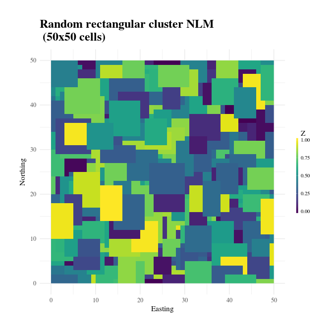
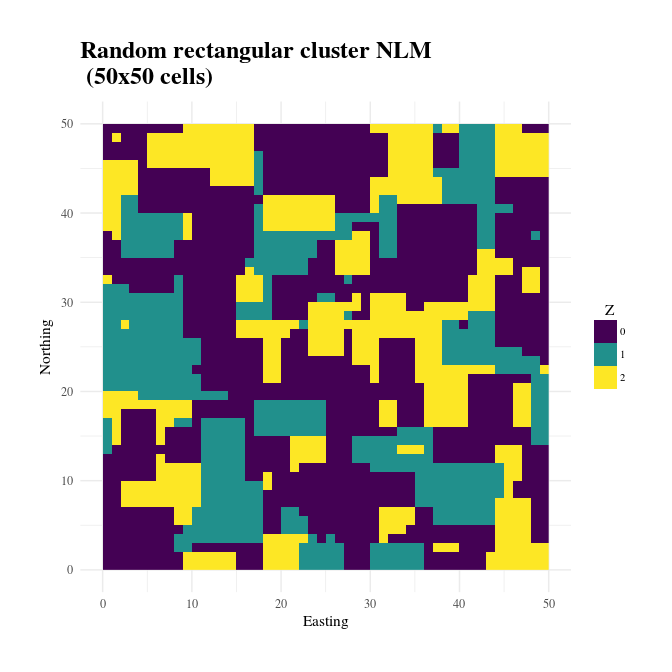

<!-- README.md is generated from README.Rmd. Please edit that file -->
[](https://travis-ci.org/marcosci/NLMR) [](https://ci.appveyor.com/project/marcosci/nlmr) [](https://codecov.io/gh/marcosci/NLMR) [](https://cran.r-project.org/package=NLMR) [](https://gitter.im/NLMR_landscapegenerator) [](http://cran.rstudio.com/web/packages/NLMR/index.html) [](https://github.com/ropensci/onboarding/issues/188)

NLMR 
=================================================================

`NLMR` is an `R` package for simulating **n**eutral **l**andscape **m**odels (NLM). Designed to be a generic framework like [NLMpy](https://pypi.python.org/pypi/nlmpy), it leverages the ability to simulate the most common NLM that are described in the ecological literature. `NLMR` builds on the advantages of the `raster`-package and returns all simulation as `RasterLayer`-objects, thus ensuring a direct compability to common GIS tasks and a pretty flexible and simple usage. Furthermore, it simulates NLMs within a self-contained, reproducible framework.


<br>

Installation
------------

Install the release version from CRAN:

``` r
install.packages("NLMR")
```

To install the developmental version of `NLMR`, use the following R code:

``` r
# install.packages("devtools")
devtools::install_github("marcosci/NLMR", ref = "develop")
```

Example
-------

Here we will provide a simple example on using `NLMR`:

``` r
library(NLMR)
library(magrittr)
library(ggplot2)  # to extend the plot functionality of NLMR 
library(SDMTools) # to calculate basic landscape metrics

# Simulate 50x50 rectangular cluster raster
nlm_raster <- nlm_randomrectangularcluster(50,50, resolution = 1, minl = 3, maxl = 7)

# Plot the NLM
util_plot(nlm_raster) +
  labs(title="Random rectangular cluster NLM \n (50x50 cells)")
#> Warning in seq.default(.limits[1], .limits[2], length = guide$nbin):
#> partial argument match of 'length' to 'length.out'
```



``` r

# Classify into 3 categories
nlm_raster <- nlm_raster %>%
                 util_classify(., c(0.5, 0.25, 0.25))

# Plot the classified NLM
util_plot(nlm_raster, discrete = TRUE) +
  labs(title="Random rectangular cluster NLM \n (50x50 cells)")
```



``` r

# Calculate basic landscape metrics
raster::as.matrix(nlm_raster) %>% 
  PatchStat() %>% 
  knitr::kable()
```

|  patchID|  n.cell|  n.core.cell|  n.edges.perimeter|  n.edges.internal|  area|  core.area|  perimeter|  perim.area.ratio|  shape.index|  frac.dim.index|  core.area.index|
|--------:|-------:|------------:|------------------:|-----------------:|-----:|----------:|----------:|-----------------:|------------:|---------------:|----------------:|
|        0|    1236|          519|                808|              4136|  1236|        519|        808|         0.6537217|     5.690141|        1.491163|        0.4199029|
|        1|     634|          224|                518|              2018|   634|        224|        518|         0.8170347|     5.078431|        1.507639|        0.3533123|
|        2|     630|          164|                614|              1906|   630|        164|        614|         0.9746032|     6.019608|        1.561874|        0.2603175|

Meta
----

-   Please [report any issues or bugs](https://github.com/marcosci/NLMR/issues/new/).
-   License: GPL3
-   Get citation information for `NLMR` in R doing `citation(package = 'NLMR')`
-   Additionally, we keep a [record of publications](https://marcosci.github.io/NLMR/articles/publication_record.html/) that use`NLMR`. Hence, if you used `NLMR` please [file an issue on GitHub](https://github.com/marcosci/NLMR/issues/new/) so we can add it to the list.
-   We are very open to contributions - if you are interested check [Contributor Code of Conduct](CONTRIBUTING.md).
-   Please note that this project is released with a [Contributor Code of Conduct](CONDUCT.md). By participating in this project you agree to abide by its terms.

Dependencies
------------

`NLMR` imports many great packages that it depends on. Many thanks to the developers of these tools:

     [1] "R (>= 3.1.0)"  " checkmate"    " dismo"        " dplyr"       
     [5] " ggplot2"      " igraph"       " magrittr"     " purrr"       
     [9] " RandomFields" " raster"       " rasterVis"    " sp"          
    [13] " spatstat"     " stats"        " tibble"       " tidyr"       
    [17] " viridis"      " extrafont"
