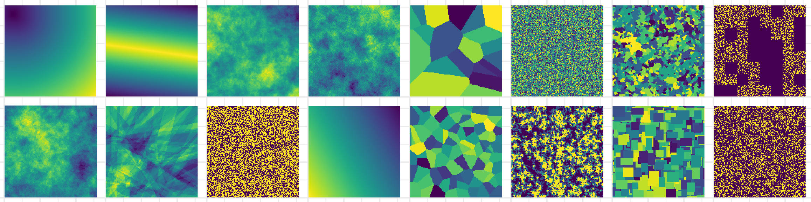

<!-- README.md is generated from README.Rmd. Please edit that file -->
[](https://travis-ci.org/marcosci/nlmr) [](https://ci.appveyor.com/project/marcosci/nlmr) [](https://codecov.io/gh/marcosci/nlmr) [](https://cran.r-project.org/package=NLMR) [](https://gitter.im/nlmr_landscapegenerator) [](http://cran.rstudio.com/web/packages/NLMR/index.html) [](https://github.com/ropensci/onboarding/issues/188)

nlmr 
=================================================================

`nlmr` is an `R` package for simulating **n**eutral **l**andscape **m**odels (NLM). Designed to be a generic framework like [NLMpy](https://pypi.python.org/pypi/nlmpy), it leverages the ability to simulate the most common NLM that are described in the ecological literature. `nlmr` builds on the advantages of the `raster`-package and returns all simulation as `RasterLayer`-objects, thus ensuring a direct compability to common GIS tasks and a pretty flexible and simple usage. Furthermore, it simulates NLMs within a self-contained, reproducible framework.



<br>

Installation
------------

Install the release version from CRAN:

``` r
install.packages("NLMR")
```

**NOTE**: The version on CRAN is pre-rOpenSci review, so it still contains the utility functions you find now in [`landscapetools`](https://github.com/marcosci/landscapetools).

To install the developmental version of `nlmr`, use the following R code:

``` r
# install.packages("devtools")
devtools::install_github("marcosci/nlmr", ref = "develop")
```

Example
-------

Simulating a neutral landscape model with `nlmr` can be achieved in a single line:

``` r
# Simulate 50x50 random cluster raster
nlm_raster <- nlmr::nlm_randomcluster(nrow = 50,
                                      ncol = 50,
                                      p    = 0.5,
                                      ai   = c(0.3, 0.6, 0.1),
                                      rescale = FALSE)
```

Landscape models simulated by nlmr are returned as raster objects, hence they can be processed as usual, e.g. visualized:

``` r
rasterVis::levelplot(nlm_raster, margin = FALSE, par.settings = rasterVis::viridisTheme())
```


Overview
--------

`nlmr` supplies 14 NLM algorithms, with several options to simulate derivates of them. The algorithms differ from each other in spatial auto-correlation, from no auto-correlation (random NLM) to a constant gradient (planar gradients):

| Function                      | Description                                                                                                                                                                                                                                                                                                                                                                                                               | Reference                                                           |
|:------------------------------|:--------------------------------------------------------------------------------------------------------------------------------------------------------------------------------------------------------------------------------------------------------------------------------------------------------------------------------------------------------------------------------------------------------------------------|:--------------------------------------------------------------------|
| nlm\_curds                    | Simulates a curdled neutral landscape model. Random curdling recursively subdivides the plane into blocks. At each level of the recursion, a fraction of the this block is declared as habitat while the remaining stays matrix. When option `q` is set, it simulates a wheyed curdling model, where previously selected cells that were declared matrix during recursion, can now contain a proportion of habitat cells. | Keitt (2000); Travis and Dytham (2004), Gustafson and Parker (1992) |
| nlm\_distancegradient         | Simulates a distance gradient neutral landscape model. The function takes the number of columns and rows as input and creates a *RasterLayer* with the same extent. *Origin* is a numeric vector of xmin, xmax, ymin, ymax for a rectangle inside the raster from which the distance is measured.                                                                                                                         | Etherington, Holland, and O’Sullivan (2015)                         |
| nlm\_edgegradient             | Simulates a linear gradient orientated on a specified or random direction that has a central peak, which runs perpendicular to the gradient direction.                                                                                                                                                                                                                                                                    | Travis and Dytham (2004)                                            |
| nlm\_fBm                      | Simulates neutral landscapes are generated using fractional Brownian motion, an extension of Brownian motion in which the amount of correlation between steps is controlled by the Hurst coefficient *H*.                                                                                                                                                                                                                 | Schlather et al. (2015)                                             |
| nlm\_gaussianfield            | Simulates a spatially correlated random fields (Gaussian random fields) model, where one can control the distance and magnitude of spatial autocorrelatian.                                                                                                                                                                                                                                                               | Schlather et al. (2015)                                             |
| nlm\_mosaicfield              | Simulates a mosaic random field neutral landscape model.                                                                                                                                                                                                                                                                                                                                                                  | Schlather et al. (2015)                                             |
| nlm\_mpd                      | Simulates a midpoint displacement neutral landscape model where the parameter *roughness* controls the level of spatial autocorrelatian.                                                                                                                                                                                                                                                                                  | Peitgen and Saupe (1988)                                            |
| nlm\_neigh                    | Simulates a neutral landscape model with categories and clustering based on neighborhood characteristic.                                                                                                                                                                                                                                                                                                                  | Scherer et al. (2016)                                               |
| nlm\_percolation              | Simulates a binary neutral landscape model based on percolation theory. The probality for a cell to be assigned a 1 is drawn from a uniform distribution.                                                                                                                                                                                                                                                                 | Gardner et al. (1989)                                               |
| nlm\_planargradient           | Simulates a planar gradient neutral landscape model with gradient sloping in a specified or random direction.                                                                                                                                                                                                                                                                                                             | Palmer (1992)                                                       |
| nlm\_polylands                | Simulates patchy mosaic neutral landscape models built on the basis of spatial point pattern processes such as the Strauss process.                                                                                                                                                                                                                                                                                       | Gaucherel (2008)                                                    |
| nlm\_random                   | Simulates a spatially random neutral landscape model with values drawn a uniform distribution.                                                                                                                                                                                                                                                                                                                            |                                                                     |
| nlm\_randomcluster            | Simulates a spatially random neutral landscape model with values drawn a uniform distribution.                                                                                                                                                                                                                                                                                                                            | Saura and Martínez-Millán (2000)                                    |
| nlm\_randomrectangularcluster | Simulates a random rectangular cluster neutral landscape model where rectangular clusters are randomly distributed until the raster is filled.                                                                                                                                                                                                                                                                            | Gustafson and Parker (1992)                                         |


Meta
----

-   Please [report any issues or bugs](https://github.com/marcosci/nlmr/issues/new/).
-   License: GPL3
-   Get citation information for `nlmr` in R doing `citation(package = 'nlmr')`
    -   Additionally, we keep a [record of publications](https://marcosci.github.io/nlmr/articles/publication_record.html/) that use`nlmr`. Hence, if you used `nlmr` please [file an issue on GitHub](https://github.com/marcosci/nlmr/issues/new/) so we can add it to the list.
-   We are very open to contributions - if you are interested check [Contributor Code of Conduct](CONTRIBUTING.md).
    -   Please note that this project is released with a [Contributor Code of Conduct](CONDUCT.md). By participating in this project you agree to abide by its terms.

Dependencies
------------

`nlmr` imports many great packages that it depends on. Many thanks to the developers of these tools:

     [1] "R (>= 3.1.0)"  " checkmate"    " dplyr"        " purrr"       
     [5] " RandomFields" " raster"       " spatstat"     " stats"       
     [9] " tibble"       " velox"        " sf"          

References
----------

Etherington, Thomas R., E. Penelope Holland, and David O’Sullivan. 2015. “NLMpy: A Python Software Package for the Creation of Neutral Landscape Models Within a General Numerical Framework.” *Methods in Ecology and Evolution* 6 (2): 164–68.

Gardner, R H, R V O’Neill, M G Turner, and V H Dale. 1989. “Quantifying Scale-Dependent Effects of Animal Movement with Simple Percolation Models.” *Landsc. Ecol.* 3 (3/4): 217–27.

Gaucherel, C. 2008. “Neutral Models for Polygonal Landscapes with Linear Networks.” *Ecol. Modell.* 219 (1-2): 39–48.

Gustafson, Eric J, and George R Parker. 1992. “Relationships Between Landcover Proportion and Indices of Landscape Spatial Pattern.” *Landsc. Ecol.* 7 (2). Kluwer Academic Publishers: 101–10.

Keitt, Timothy H. 2000. “Spectral Representation of Neutral Landscapes.” *Landsc. Ecol.* 15: 479–93.

Palmer, Michael W. 1992. “The Coexistence of Species in Fractal Landscapes.” *Am. Nat.* 139 (2): 375.

Peitgen, Heinz-Otto, and Dietmar Saupe, eds. 1988. *The Science of Fractal Images*. New York, NY, USA: Springer-Verlag New York, Inc.

Saura, Santiago, and Javier Martínez-Millán. 2000. “Landscape Patterns Simulation with a Modified Random Clusters Method.” *Landsc. Ecol.* 15 (7): 661–78.

Scherer, Cédric, Florian Jeltsch, Volker Grimm, and Niels Blaum. 2016. “Merging Trait-Based and Individual-Based Modelling: An Animal Functional Type Approach to Explore the Responses of Birds to Climatic and Land Use Changes in Semi-Arid African Savannas.” *Ecol. Modell.* 326 (April): 75–89.

Schlather, Martin, Alexander Malinowski, Peter J Menck, Marco Oesting, Kirstin Strokorb, and Others. 2015. “Analysis, Simulation and Prediction of Multivariate Random Fields with Package RandomFields.” *J. Stat. Softw.* 63 (8). Foundation for Open Access Statistics: 1–25.

Travis, J M J, and C Dytham. 2004. “A Method for Simulating Patterns of Habitat Availability at Static and Dynamic Range Margins.” *Oikos* 104 (2). Munksgaard International Publishers: 410–16.
