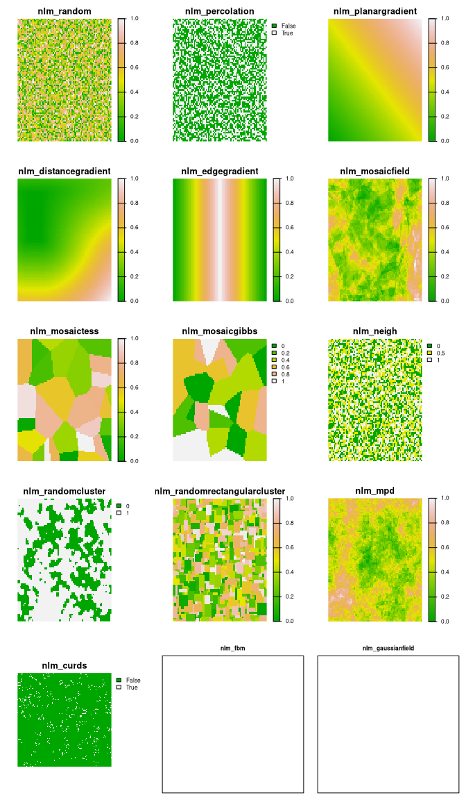

<!-- badges: start -->

[](https://github.com/ropensci/NLMR/actions)
[](https://app.codecov.io/gh/ropensci/NLMR)
[](https://cran.r-project.org/package=NLMR)
[](https://cran.r-project.org/package=NLMR)
[](https://github.com/ropensci/software-review/issues/188)
[](https://doi.org/10.1111/2041-210X.13076)

<!-- badges: end -->

# NLMR 

**NLMR** is an `R` package for simulating **n**eutral **l**andscape
**m**odels (NLM). Designed to be a generic framework like
[NLMpy](https://pypi.org/project/nlmpy/), it leverages the ability to
simulate the most common NLM that are described in the ecological
literature. **NLMR** builds on the advantages of the **terra** package
and returns all simulations as `SpatRaster` objects, thus ensuring
direct compatibility with common GIS tasks and a flexible and simple
usage. Furthermore, it simulates NLMs within a self-contained,
reproducible framework.

## Installation

NLMR is currently not available on CRAN. The only way to install NLMR at
the moment is:

``` r
# install.packages("remotes")
remotes::install_github("ropensci/NLMR")
```

<!-- Windows users need to install RTools first. Rtools provides a compiler and some helpers to compile code for R in Windows. Download Rtools from here: [https://cran.r-project.org/bin/windows/Rtools/](https://cran.r-project.org/bin/windows/Rtools/). -->

<!-- Install Rtools in a directory with no fancy characters in its path, e.g. `C:\R\Rtools` is safe. To install, right click on the `Rtools40.exe` and select “Run as administrator”. During the installation make sure to select "Add Rtools to PATH". Otherwise, accept all defaults for everything else. -->

## Example

Each neutral landscape model is simulated with a single function (all
starting with `nlm_`) in **NLMR**, e.g.:

``` r
random_cluster <- NLMR::nlm_randomcluster(nrow = 100,
                                          ncol = 100,
                                          p    = 0.5,
                                          ai   = c(0.3, 0.6, 0.1),
                                          rescale = FALSE)

random_curdling <- NLMR::nlm_curds(curds = c(0.5, 0.3, 0.6),
                                   recursion_steps = c(32, 6, 2))


midpoint_displacememt <- NLMR::nlm_mpd(ncol = 100,
                                       nrow = 100,
                                       roughness = 0.61)
```

## Overview

**NLMR** supplies 15 NLM algorithms, with several options to simulate
derivatives of them. The algorithms differ from each other in spatial
auto-correlation, from no auto-correlation (random NLM) to a constant
gradient (planar gradients):

<table class="table table-striped table-hover table-condensed" style="margin-left: auto; margin-right: auto;">

<thead>

<tr>

<th style="text-align:left;">

Function
</th>

<th style="text-align:left;">

description
</th>

<th style="text-align:left;">

reference
</th>

</tr>

</thead>

<tbody>

<tr>

<td style="text-align:left;">

nlm_percolation
</td>

<td style="text-align:left;">

Binary landscapes from thresholded random draws.
</td>

<td style="text-align:left;">

Gardner et al. (1989)
</td>

</tr>

<tr>

<td style="text-align:left;">

nlm_neigh
</td>

<td style="text-align:left;">

Categorical landscapes shaped by neighbourhood effects.
</td>

<td style="text-align:left;">

Scherer et al. (2016)
</td>

</tr>

<tr>

<td style="text-align:left;">

nlm_randomcluster
</td>

<td style="text-align:left;">

Nearest-neighbour random clusters.
</td>

<td style="text-align:left;">

Saura and Martinez-Millan (2000)
</td>

</tr>

<tr>

<td style="text-align:left;">

nlm_randomrectangularcluster
</td>

<td style="text-align:left;">

Overlapping rectangular clusters.
</td>

<td style="text-align:left;">

Gustafson and Parker (1992)
</td>

</tr>

<tr>

<td style="text-align:left;">

nlm_gaussianfield
</td>

<td style="text-align:left;">

Spatially correlated Gaussian random fields.
</td>

<td style="text-align:left;">

Schlather et al. (2015)
</td>

</tr>

<tr>

<td style="text-align:left;">

nlm_curds
</td>

<td style="text-align:left;">

Recursive curdling with optional wheying.
</td>

<td style="text-align:left;">

O’Neill, Gardner, and Turner (1992); Keitt (2000)
</td>

</tr>

<tr>

<td style="text-align:left;">

nlm_fbm
</td>

<td style="text-align:left;">

Fractional Brownian motion surfaces.
</td>

<td style="text-align:left;">

Schlather et al. (2015)
</td>

</tr>

<tr>

<td style="text-align:left;">

nlm_mpd
</td>

<td style="text-align:left;">

Midpoint displacement surfaces.
</td>

<td style="text-align:left;">

Peitgen and Saupe (1988)
</td>

</tr>

<tr>

<td style="text-align:left;">

nlm_distancegradient
</td>

<td style="text-align:left;">

Distance gradients measured from a rectangular origin.
</td>

<td style="text-align:left;">

Etherington, Holland, and O’Sullivan (2015)
</td>

</tr>

<tr>

<td style="text-align:left;">

nlm_edgegradient
</td>

<td style="text-align:left;">

Directional gradients with a central peak.
</td>

<td style="text-align:left;">

Travis and Dytham (2004); Schlather et al. (2015)
</td>

</tr>

<tr>

<td style="text-align:left;">

nlm_planargradient
</td>

<td style="text-align:left;">

Linear gradients in a specified or random direction.
</td>

<td style="text-align:left;">

Palmer (1992)
</td>

</tr>

<tr>

<td style="text-align:left;">

nlm_random
</td>

<td style="text-align:left;">

Independent random values drawn for each cell.
</td>

<td style="text-align:left;">

With and Crist (1995)
</td>

</tr>

<tr>

<td style="text-align:left;">

nlm_mosaicfield
</td>

<td style="text-align:left;">

Mosaic random fields generated by repeated bisection.
</td>

<td style="text-align:left;">

Schlather et al. (2015)
</td>

</tr>

<tr>

<td style="text-align:left;">

nlm_mosaicgibbs
</td>

<td style="text-align:left;">

Inhibited point-pattern tessellations.
</td>

<td style="text-align:left;">

Gaucherel (2008), Method 2
</td>

</tr>

<tr>

<td style="text-align:left;">

nlm_mosaictess
</td>

<td style="text-align:left;">

Voronoi tessellations from random seed points.
</td>

<td style="text-align:left;">

Gaucherel (2008), Method 1
</td>

</tr>

</tbody>

</table>

## Algorithm examples

Example outputs for the algorithms implemented in `NLMR`.

<!-- -->

## Meta

- Please [report any issues or
  bugs](https://github.com/ropensci/NLMR/issues/new/).
- License: GPL3
- Get citation information for `NLMR` in R doing
  `citation(package = 'NLMR')`
- We are very open to contributions - if you are interested check out
  our [Contributor Guidelines](CONTRIBUTING.md).
  - Please note that this project is released with a [Contributor Code
    of Conduct](CONDUCT.md). By participating in this project you agree
    to abide by its terms.

[](https://ropensci.org/)
