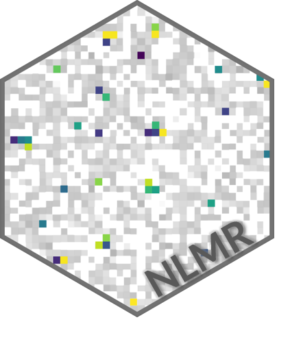

[](https://travis-ci.org/marcosci/NLMR)
[](https://ci.appveyor.com/project/marcosci/nlmr)
[](https://codecov.io/gh/marcosci/NLMR)
[](https://cran.r-project.org/package=NLMR) 
[](https://gitter.im/NLMR_landscapegenerator) 
[](http://cran.rstudio.com/web/packages/NLMR/index.html) 
[](https://github.com/ropensci/onboarding/issues/188)

```{r setup, include=FALSE}
knitr::opts_chunk$set(echo = TRUE)
knitr::opts_chunk$set(
  collapse = TRUE,
  comment = "#>",
  fig.path = "vignettes/README-"
)
```

<i class="fa fa-code" aria-hidden="true"></i> **NLMR** 
------------------------------------------------------------

**N**eutral **L**andscape **M**odels with **R**

------------------------------------------------------------------------

**NLMR** is an ``R`` package for simulating **n**eutral **l**andscape **m**odels (NLM). Designed to be a generic framework like [NLMpy](https://pypi.python.org/pypi/nlmpy), it leverages the ability to simulate the most common NLM that are described in the ecological literature. 
``NLMR`` exploits the advantages of the ``raster``-package and returns all simulation as ``RasterLayer``-objects, thus ensuring a direct compability to common GIS tasks and a pretty flexible and simple usage.
Furthermore, it simulates NLMs within a self-contained, reproducible framework.


------------------------------------------------------------------------

<i class="fa fa-cubes" aria-hidden="true"></i> Why NLMR?  <small> ... and not one of the other software tools<a href="https://marcosci.github.io/NLMR/articles/faq.html"><sup>\*</sup></a></small>
------------------------------------------------------------

* It is so far the only library of NLM in ``R``
    * R is the <small>programming</small> lingua franca for ecologists
    * Open-source + cross-platform
* Most comprehensive collection of algorithms to simulate NLM
* Embedded in a native GIS framework
* Variety of utility functions (classification, merging, visualization, ...)
* Openly developed on [github](https://github.com/marcosci/NLMR)
    * If something is missing or annoys you - [get in touch](https://github.com/marcosci/NLMR/issues/new)
 

------------------------------------------------------------------------

<i class="fa fa-cog" aria-hidden="true"></i> Getting Started
------------------------------------------------------------

Install the release version from CRAN:

```{r eval = FALSE}
install.packages("NLMR")
```

To install the developmental version of ``NLMR``, use the following R code:

```{r eval = FALSE}
# install.packages("devtools")
devtools::install_github("marcosci/NLMR")
```


------------------------------------------------------------------------

<i class="fa fa-book" aria-hidden="true"></i> Documentation
------------------------------------------------------------

Documentation is available at [NLMR/reference](https://marcosci.github.io/NLMR/reference). To get started, please explore our [vignettes online](https://marcosci.github.io/NLMR/articles/), or in R:

```{r eval = FALSE}
vignette(package = "NLMR")
```

------------------------------------------------------------------------

<i class="fa fa-newspaper-o" aria-hidden="true"></i> What's New
---------------------------------------------------------------

We are currently on version `0.2.1`. Major changes in this version are:

- Skip one test on CRAN to keep the Roboto font available
- Function `util_facetplot` to plot a list of rasters as ggplot2 facet
- Small updates to the webpage

See our [<i class="fa fa-newspaper-o aria-hidden="true"></i> news](news/index.html) page for a detailed changelog. 

------------------------------------------------------------------------

<i class="fa fa-pencil" aria-hidden="true"></i> Citation
-------------------------------------------------------

```{r, echo  = FALSE, result = "asis", comment = ""}
citation("NLMR")
```


Additionally, we keep a [record of publications](https://marcosci.github.io/NLMR/articles/publication_record.html/) that use`NLMR`.
Hence, if you used `NLMR` please [file an issue on GitHub](https://github.com/marcosci/NLMR/issues/new/) so we can add it to the list.

------------------------------------------------------------------------

<i class="fa fa-glass" aria-hidden="true"></i> Contributor Code of Conduct
-------------------------------------------------------

Please note that this project is released with a [Contributor Code of Conduct](CONDUCT.md). By participating in this project you agree to abide by its terms.


------------------------------------------------------------------------

<i class="fa fa-shopping-basket" aria-hidden="true"></i> Dependencies
-------------------------------------------------------

**NLMR** imports many great packages that it depends on. Many thanks to the developers of these tools:

```{r, echo  = FALSE, result = "asis", comment = ""}
desc = read.dcf("/home/marco/PhD_Cloud/7_Code/NLMR/DESCRIPTION")
headings = dimnames(desc)[[2]]
fields = which(headings %in% c("Depends", "Imports"))
pkgs = paste(desc[fields], collapse = ", ")
pkgs = gsub("\n", " ", pkgs)
strsplit(pkgs, ",")[[1]]
```
