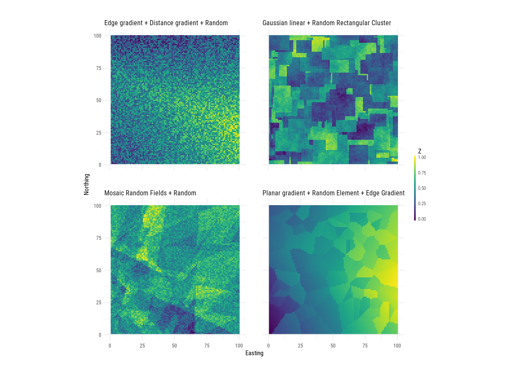

```{r, echo = FALSE}
knitr::opts_chunk$set(
  collapse = TRUE,
  comment = "#>",
  fig.path = "README-"
)
```

## Core models


```{r, , echo=FALSE, message=FALSE, dpi = 200, fig.align='center'}
knitr::include_graphics("bestiary_full.png")
```


## NLMR Merges
```{r, , echo=FALSE, message=FALSE, dpi = 200, fig.align='center'}

```

